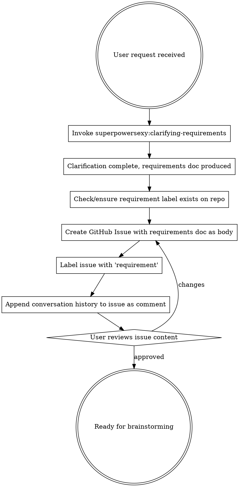

# Nession Writing Requirements

## Overview

Turn feature requests into structured requirements documents stored as GitHub Issues with the `requirement` label. Uses `superpowersexy:clarifying-requirements` for the clarification dialogue, then uploads the result to a GitHub Issue instead of saving to the local filesystem. All subsequent modifications update the same issue.

Core principle: **Requirements live in GitHub Issues, not in the repo.** This keeps requirements visible, searchable, and linked to the implementation PRs that reference them.

## When to Use

- User describes a new feature or enhancement for Nession
- User asks to "record requirements" or "create a requirement document"
- User says "write this down as a requirement"
- Feature discussion produces decisions worth preserving as a formal artifact

**Don't use for:**
- Bug reports → create a GitHub Issue with the `bug` label directly
- Implementation planning → that's `superpowers:brainstorming` territory
- Quick fixes with no design ambiguity → just fix them

## Process



## Checklist

You MUST create a task for each of these items and complete them in order:

1. **Invoke clarifying-requirements** — use `superpowersexy:clarifying-requirements` to understand what the user wants
2. **Complete clarification** — produce a validated requirements document following the clarifying-requirements process
3. **Ensure label exists** — check if `requirement` label exists on `BestNathan/nession`, create it if not
4. **Create GitHub Issue** — upload the requirements document as the issue body
5. **Apply labels** — add the `requirement` label (and any others the user wants)
6. **Save conversation history** — add a comment to the issue with the full dialogue record
7. **User reviews** — ask user to review the issue, iterate if needed
8. **Transition to brainstorming** — invoke `superpowers:brainstorming`

## The Process

### Step 1: Invoke clarifying-requirements

**REQUIRED SUB-SKILL:** Use `superpowersexy:clarifying-requirements` for the entire clarification dialogue.

Follow the clarifying-requirements process exactly — restate, ask grouped questions with options, explore context, identify edge cases, define success criteria. The ONLY difference is where the final document lands.

**This IS the requirements process.** The only thing our skill changes is the storage backend (GitHub Issues instead of local files) and the conversation history preservation.

### Step 2: After clarification — prepare the issue content

**IMPORTANT:** `superpowersexy:clarifying-requirements` normally saves to `docs/superpowers/requirement/...`. **Skip that local file step.** Instead, take the validated requirements document content and use it as the GitHub Issue body. The issue IS the requirements document.

Once clarifying-requirements produces a validated requirements document, construct the GitHub Issue body:

```markdown
## Requirements: [Topic]

[Full requirements document content from clarifying-requirements]

---
**Status:** Draft | In Discussion | Approved
**Created:** [YYYY-MM-DD]
**Author:** [user name]
```

Use the exact structure from clarifying-requirements: Background, Goals, Non-Goals, Scope, Constraints, Success Criteria, Edge Cases, Open Questions.

### Step 3: Ensure the `requirement` label exists

```bash
# Check if label exists
gh label list --repo BestNathan/nession --search requirement

# Create if missing
gh label create requirement --repo BestNathan/nession \
  --color "0E8A16" \
  --description "Feature requirements and specifications"
```

The color `0E8A16` is green — distinct from the existing labels (bug=red, enhancement=blue, documentation=blue).

**Do NOT skip this step.** If the label doesn't exist, the issue won't be filterable. Creating it once is fine (idempotent — gh returns an error if it already exists, just ignore it).

### Step 4: Create the GitHub Issue

```bash
gh issue create \
  --repo BestNathan/nession \
  --title "Requirement: [Topic]" \
  --body "[Full requirements document]" \
  --label requirement
```

**Title format:** Always prefix with `Requirement: ` so issues are easily distinguishable from bugs and feature requests.

**Body:** The full requirements document from Step 2. Use proper markdown formatting.

### Step 5: Append conversation history

After creating the issue, add the conversation record as a comment:

```bash
gh issue comment [ISSUE_NUMBER] \
  --repo BestNathan/nession \
  --body "[Conversation history]"
```

The conversation history comment should have this structure:

```markdown
## Conversation History

### [YYYY-MM-DD HH:MM] — Initial Request

**User:** [original request, verbatim]

**Agent:** [restatement]

**User:** [confirmation/correction]

### [YYYY-MM-DD HH:MM] — Round 1: Purpose & Audience

**Agent:** [questions asked]
**User:** [answers]

### [YYYY-MM-DD HH:MM] — Round 2: Scope

**Agent:** [questions asked]
**User:** [answers]

[... continue for all rounds ...]

### [YYYY-MM-DD HH:MM] — Requirements Finalized

Requirements document agreed upon and uploaded to this issue.
```

**Why conversation history matters:**
- Future readers understand the WHY behind decisions
- Tradeoffs discussed during clarification are preserved
- Someone revisiting the requirement months later can see the full context
- Disagreements and resolutions are documented

### Step 6: User review

After creating the issue, present the link and ask for review:

> "Requirements uploaded to GitHub Issue: `https://github.com/BestNathan/nession/issues/[N]`
>
> Please review the requirements document and conversation history. Let me know if anything needs to be changed before we move to design."

### Step 7: Handle changes

When the user requests changes to the requirements:

1. **Edit the issue body** — update the requirements document in-place:
   ```bash
   gh issue edit [ISSUE_NUMBER] --repo BestNathan/nession --body "[Updated document]"
   ```

2. **Add a comment** with the change discussion:
   ```bash
   gh issue comment [ISSUE_NUMBER] --repo BestNathan/nession --body "[Change conversation]"
   ```

3. **Update the Status** in the issue body (Draft → In Discussion → Approved)

**NEVER create a new issue for changes to the same requirement.** One requirement = one issue. The issue is the single source of truth.

### Step 8: Transition

After user approval, invoke `superpowers:brainstorming` to explore design approaches.

## Quick Reference

| Action | Command |
|--------|---------|
| Check labels | `gh label list --repo BestNathan/nession` |
| Create `requirement` label | `gh label create requirement --repo BestNathan/nession --color "0E8A16" --description "Feature requirements and specifications"` |
| Create issue | `gh issue create --repo BestNathan/nession --title "Requirement: [Topic]" --body "..." --label requirement` |
| Comment on issue | `gh issue comment [N] --repo BestNathan/nession --body "..."` |
| Edit issue body | `gh issue edit [N] --repo BestNathan/nession --body "..."` |
| List requirement issues | `gh issue list --repo BestNathan/nession --label requirement` |

## Issue Lifecycle

```
Draft → In Discussion → Approved → (linked to implementation PR) → Closed
```

- **Draft:** Just created, awaiting user review
- **In Discussion:** Changes being made based on feedback
- **Approved:** User confirmed, ready for brainstorming → implementation
- **Closed:** Implementation PR merged, requirement fulfilled

Update the Status line in the issue body as it progresses.

## Edge Cases

### No `gh` CLI available
If `gh` is not installed or authenticated, fall back to the clarifying-requirements default: save to `docs/superpowers/requirement/YYYY-MM-DD-<topic>-requirement.md`. Tell the user: "GitHub CLI not available — requirements saved locally instead. Install and authenticate `gh` for Issue integration."

### Multiple requirement discussions active
Track which issue number corresponds to which requirement. If the user says "change the dark mode requirement," search for the issue by title:
```bash
gh issue list --repo BestNathan/nession --label requirement --search "dark mode"
```

### `requirement` label already exists
`gh label create` returns an error if the label exists. Ignore this — the label is already set up.

### Very long conversation history
If the conversation history exceeds GitHub's comment character limit (~65536 chars), summarize older rounds and keep the most recent rounds verbatim.

## Common Mistakes

| Mistake | Fix |
|---------|-----|
| Saving requirements to local file | Upload to GitHub Issue instead |
| Creating multiple issues for same requirement | One requirement = one issue, edit in-place |
| Forgetting conversation history | Always add the history comment after creating the issue |
| Skipping label creation check | Always ensure `requirement` label exists |
| Creating issue before clarification done | Complete clarifying-requirements first |
| Using wrong label | Use `requirement` (green), not `enhancement` (blue) |
| Not updating Status line | Update Draft → In Discussion → Approved as it progresses |

## Common Rationalizations

| Excuse | Reality |
|--------|---------|
| "I'll create the issue later" | Later never comes. Create it NOW, while the requirements are fresh. |
| "The conversation is in the chat history, no need to save it" | Chat history is invisible to future developers and other agents. Save it in the issue. |
| "I'll just save it locally and upload later" | Local files are invisible to the team. The issue IS the source of truth. |
| "This is too simple for an issue" | Simple features still benefit from a written requirement that can be referenced in the PR. |
| "The user hasn't asked for an issue" | They asked for requirements documentation. The issue IS the documentation. |
| "I don't want to bother the user with review" | The review step takes <1 minute and prevents hours of misdirected work. |

## Red Flags - STOP and Start Over

- Writing requirements to a local file instead of creating a GitHub Issue
- Creating an issue without the `requirement` label
- Skipping the clarifying-requirements process
- Creating a new issue for changes to an existing requirement
- Omitting conversation history from the issue
- "I'll create the issue after the brainstorming session"

**All of these mean: Go back. Follow the process from Step 1.**

## Relationship to Other Skills

```
User Request → nession-writing-requirements → brainstorming → writing-plans → executing-plans
                  (this skill: clarify +     (HOW)         (steps)       (build)
                   GitHub Issue)
```

- **superpowersexy:clarifying-requirements**: The dialogue engine (invoked by this skill)
- **nession-writing-requirements**: The storage layer (this skill — GitHub Issues instead of local files)
- **superpowers:brainstorming**: Next step after requirements approved
