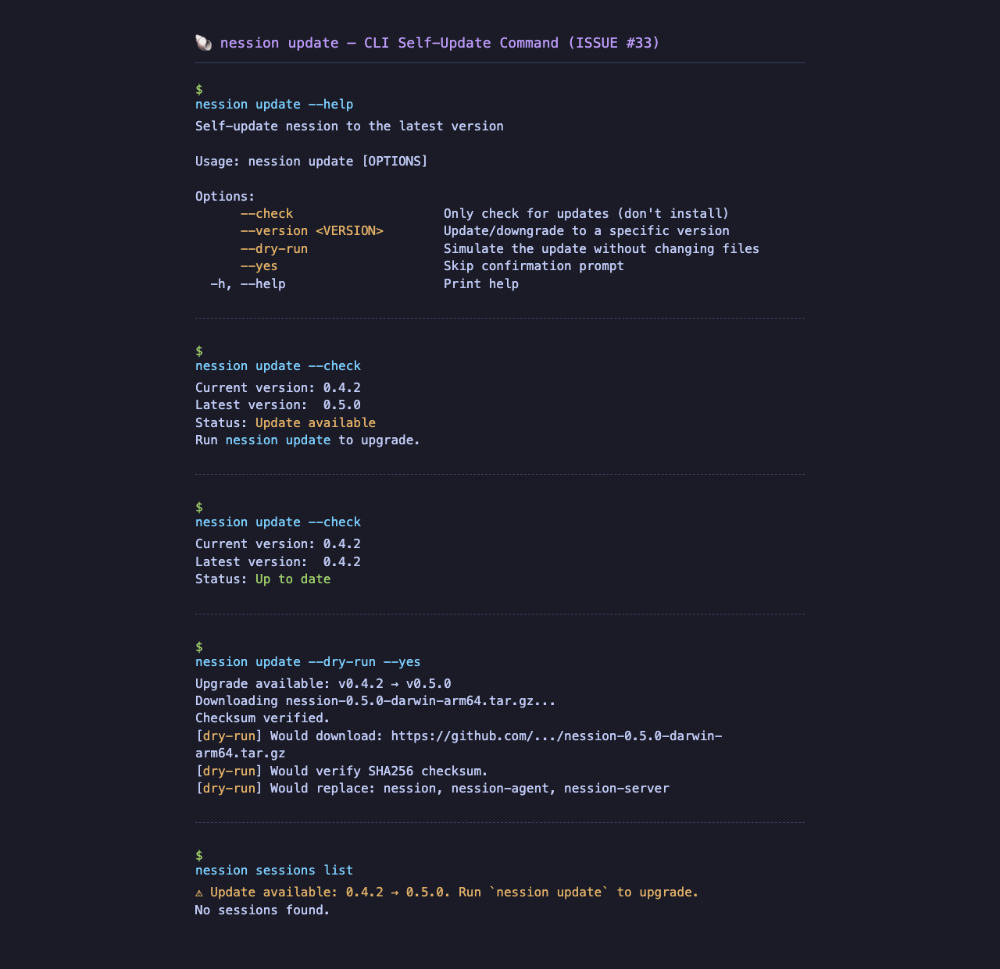

# Nession CLI Self-Update — Screenshots

## `nession update --help`



## CLI Reference

### Commands
```bash
nession update                 # Detect and upgrade to latest
nession update --check         # Only check, print status
nession update --version 0.3.5 # Upgrade/downgrade to specific version
nession update --dry-run       # Simulate without changing files
nession update --yes           # Skip confirmation prompt
```

### Background Check
Every CLI invocation (except `--help`/`--version`) checks for updates:
```
⚠ Update available: 0.4.2 → 0.5.0. Run `nession update` to upgrade.
```
Cached for 30 minutes. Disable with `NESSION_NO_UPDATE_CHECK=1`.

### Verification
```bash
# From GitHub Release:
sha256sum -c checksums.txt
```

## Test Coverage (94.3%)
| File | Coverage |
|------|----------|
| cache.rs | 17/17 (100%) |
| version.rs | 11/11 (100%) |
| mod.rs | 10/10 (100%) |
| download.rs | 61/62 (98%) |
| check.rs | 30/31 (97%) |
| replace.rs | 72/79 (91%) |
| github.rs | 66/73 (90%) |
