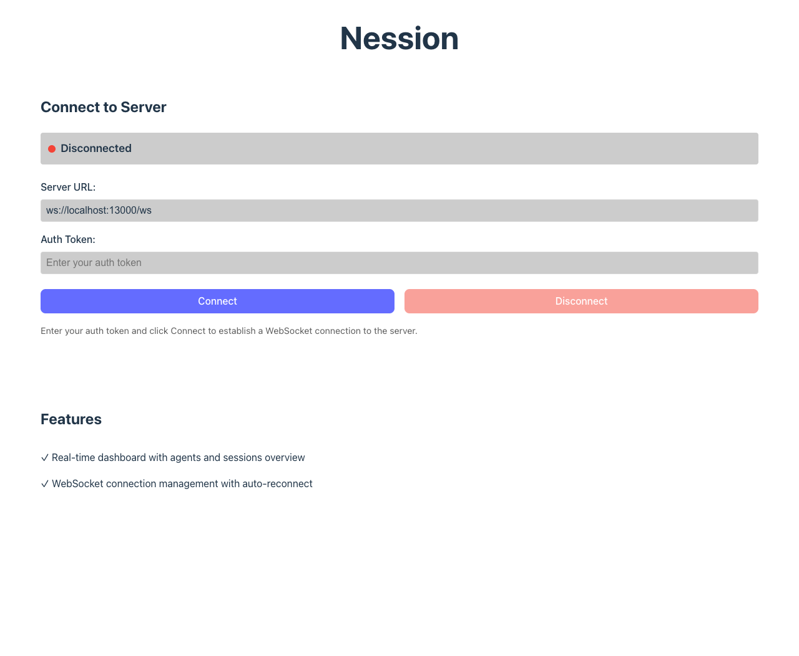
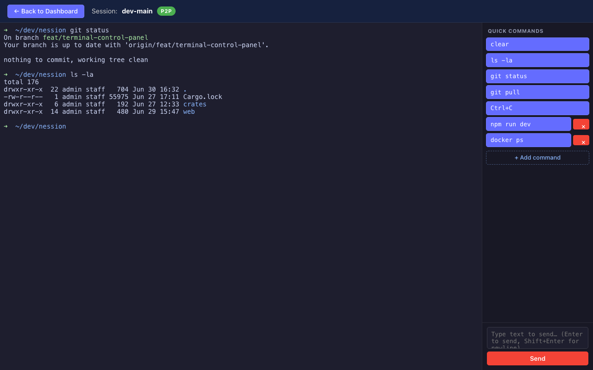
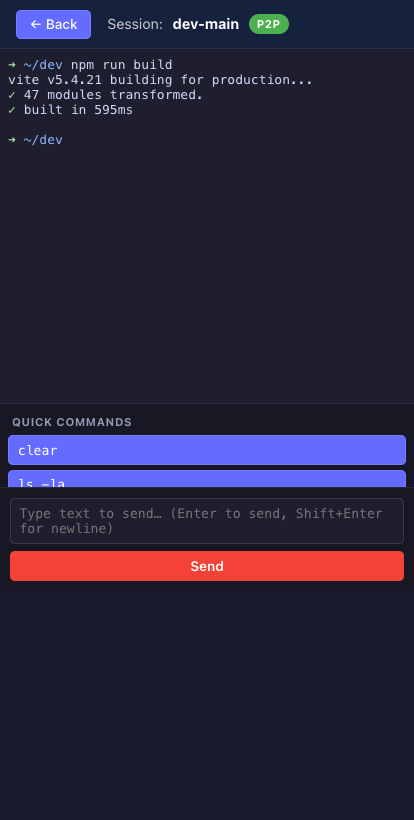

# Terminal Control Panel — Screenshots

Screenshots of the terminal control panel feature (`feat/terminal-control-panel`).

The connect screen is captured against the real running app. The terminal-view
shots render the **real** `ControlPanel` component (and a live xterm.js terminal
with sample output) via the Vite dev server, since the full terminal view
requires a connected backend agent to reach in a live session.

## 1. Connect screen

The entry screen: server URL + auth token, then Connect.

## 2. Terminal view with control panel (desktop)

Terminal on the left; the control panel sidebar on the right shows:

- **Quick Commands** — presets (`clear`, `ls -la`, `git status`, `git pull`,
  `Ctrl+C`) plus user-added commands (`npm run dev`, `docker ps`) with a `×`
  delete control, and a `+ Add command` button.
- **Free input** — a textarea (Enter to send, Shift+Enter for newline) and a
  Send button. Sends append `\r` to auto-execute; `Ctrl+C` is sent raw (`\x03`,
  no trailing `\r`).

## 3. Responsive / mobile (stacked)

Below 768px the sidebar drops below the terminal (column layout) so both stay
usable on narrow screens.
